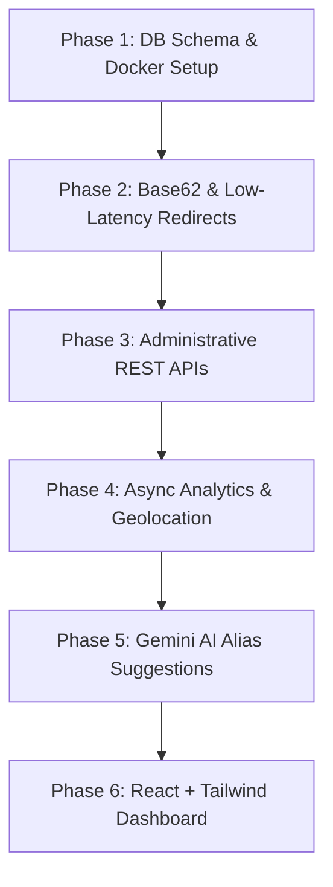

# Approach & Planning

This document details the engineering planning, phases, and database modeling approach taken to implement the AI-Powered URL Shortener Dashboard.

## 1. Problem Understanding

The core objective is to build a lightweight marketing campaign URL shortening tool (similar to Bitly) with three primary capabilities:
1. **Low-Latency Redirection:** Short URL redirects (`/r/:code`) must execute in under 100ms.
2. **Campaign Control Panel:** A dashboard to search, create, edit, deactivate, and soft-delete campaign links without requiring full page refreshes (Single Page App).
3. **Audience Intelligence:** Capture geolocation country (via client IP), browser details, operating system, referrer, and daily click timelines, with automated alias suggestions enriched by Gemini.

---

## 2. Implementation Strategy

To build this systematically, the project was executed in six consecutive phases:

### Phase 1: Database Setup & Resiliency Modeling
* Designed schemas for `links` and `clicks` tables.
* Added Database Indexes on `short_code` and `custom_alias` to ensure O(log N) lookup times.
* Implemented the **Repository Pattern** supporting both PostgreSQL and SQLite fallback. If Postgres is unreachable (e.g. docker containers not running), the server degrades gracefully to a local `database.sqlite` file, making it completely runnable out-of-the-box.

### Phase 2: Redirection Engine & Cache-Aside Pattern
* Developed a Base62 utility to convert incremental IDs or generate random hashes.
* Configured the **Read-Through / Cache-Aside** pattern. Lookups check Redis (in-memory, O(1)) first, querying the DB only on cache misses, and caching the target URL for subsequent clicks. If Redis is down, it degrades to an in-memory Map.

### Phase 3: REST API & Schemas
* Created Express routes for CRUD actions.
* Integrated `zod` schema validator middleware to sanitize URLs, aliases, and check that expiration dates occur in the future.

### Phase 4: Async Analytics & IP Geolocation
* Implemented a non-blocking execution flow. REDIRECTS execute immediately (returning `302 Redirect`); client info (User-Agent parsing, Referrer host formatting, IP Geolocation via `ip-api.com` or mock dev-IP loopback mapping) is resolved and written to the database asynchronously.
* This guarantees redirections stay well under the 100ms threshold.

### Phase 5: AI-Powered Enrichment (Gemini)
* Connected the `gemini-2.5-flash-preview-09-2025` model to fetch SEO/click-friendly custom aliases based on target URLs and titles.
* Configured Gemini to output structured JSON matching a strict schema.
* Created a programmatic fallback generator to create smart titles if the API key is not configured or fails.

### Phase 6: Single-Page React Dashboard
* Built a sleek glassmorphic dark-mode dashboard using React + Tailwind CSS.
* Integrated responsive Area charts from `recharts` for timeline analytics, and cards for KPIs.

---

## 3. Database Schema Design

### `links` Table
Stores metadata for campaign destinations and short code mappings.
* `id`: Auto-incrementing primary key.
* `title`: Title identifying the marketing campaign.
* `original_url`: The raw destination URL.
* `short_code`: Automatically generated unique alphanumeric code.
* `custom_alias`: User-provided custom string (optional).
* `is_active`: Boolean to toggle redirect state.
* `expires_at`: Expiration timestamp (optional).
* `created_at`: Row creation timestamp.
* `deleted_at`: Soft-delete tracker timestamp.

### `clicks` Table
Stores analytical visit events. Relates 1-to-many with the `links` table.
* `id`: Auto-incrementing primary key.
* `link_id`: Foreign key pointing to `links.id` (cascades on delete).
* `clicked_at`: Timestamp of redirect event.
* `browser`: Parsed browser name (Chrome, Safari, Firefox, etc.).
* `operating_system`: Parsed OS name (Windows, macOS, iOS, Android, etc.).
* `country`: Geolocation country code/name resolved from IP.
* `referrer`: The referrer hostname or "Direct".
