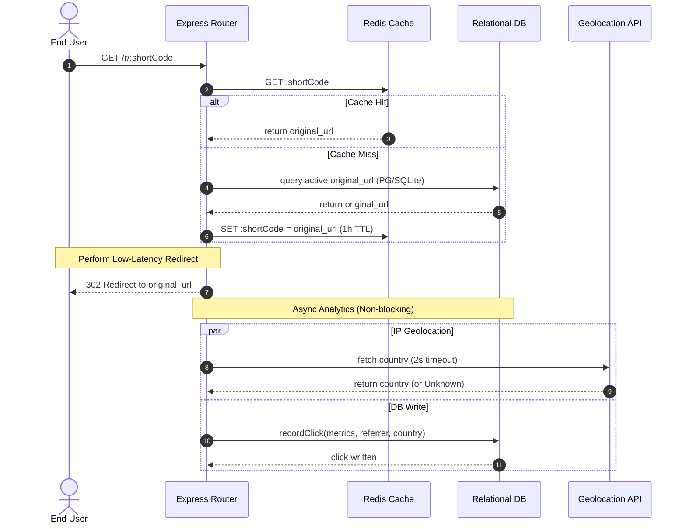

# System Architecture

The AI-Powered URL Shortener is built as a split-tier client-server application designed for high-concurrency and sub-100ms redirections.

---

## 1. Architectural Blueprint

The system components are decoupled to ensure independent scaling, failure isolation, and fast boot times.

```
                  +--------------------------------+
                  |      React + Tailwind SPA      | (Dashboard Client)
                  +---------------+----------------+
                                  | HTTP REST API
                                  v
                  +--------------------------------+
                  |       Express API Server       | (Node.js/TypeScript)
                  +----+----------------------+----+
                       |                      |
            Cache Read/|                      |Query/Persist
            Write      v                      v
              +--------+----+          +------+-------+
              |    Redis    |          |  PostgreSQL  | (Relational Data &
              | (Or Memory) |          | (Or SQLite)  |  Analytical Clicks)
              +-------------+          +--------------+
```

### Decoupling Logic
1. **Frontend (Vite + React + Tailwind CSS):** A responsive, single-page application that serves metrics, tables, and modals. Communicates with the backend through REST endpoints, updating components asynchronously (without full page refreshes).
2. **Backend (Node.js + Express + TypeScript):** Standardized, stateless REST server that handles API requests, validates inputs using Zod schemas, encodes strings, and acts as the gateway to the database, cache, and Gemini.
3. **Cache (Redis / In-Memory):** Houses temporary mappings of hot URLs. Redirection endpoint queries this layer first to keep response times under 100ms.
4. **Relational Database (PostgreSQL / SQLite):** Stores structural campaign links and visit rows. Relational schemas enable fast aggregate queries for referrer, device, and browser analytics.

---

## 2. Sequence Diagram: Redirection Engine

To maintain sub-100ms redirect latencies, database lookups are bypassed using an in-memory cache, and analytics persistence is executed **completely asynchronously after** sending the 302 HTTP Redirect header back to the user.



---

## 3. Project Directory Map

```
url-shortener/
├── docker-compose.yml         # Dev database & cache definitions
├── docs/                      # Architectural & design guides
│   ├── approach.md
│   ├── architecture.md
│   ├── tradeoffs.md
│   └── prompts.md
├── backend/                   # REST API App
│   ├── src/
│   │   ├── config/            # PostgreSQL, SQLite, and env configurations
│   │   ├── controllers/       # Route controllers (Links, Analytics, Redirects)
│   │   ├── middleware/        # Input schema validators (Zod)
│   │   ├── routes/            # REST API route mappings
│   │   ├── services/          # Cache (Redis/Map) & Gemini AI services
│   │   ├── utils/             # Base62, Geolocation, and UA parsing utilities
│   │   ├── tests/             # Jest unit & API integration tests
│   │   └── app.ts             # Express server bootstrapper
│   ├── package.json
│   └── tsconfig.json
└── frontend/                  # React App
    ├── src/
    │   ├── utils/             # REST client API requests
    │   ├── App.tsx            # Navigation, tables, charts, and modal views
    │   ├── main.tsx           # React mounting bootstrapper
    │   └── index.css          # Tailwind CSS style variables
    ├── package.json
    └── tailwind.config.js
```
